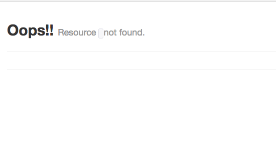
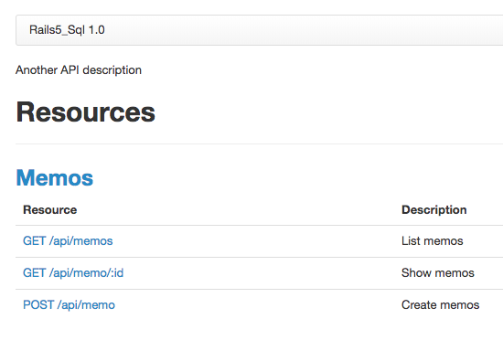
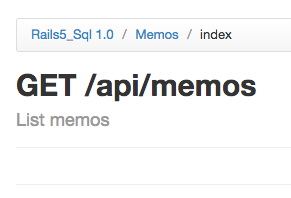
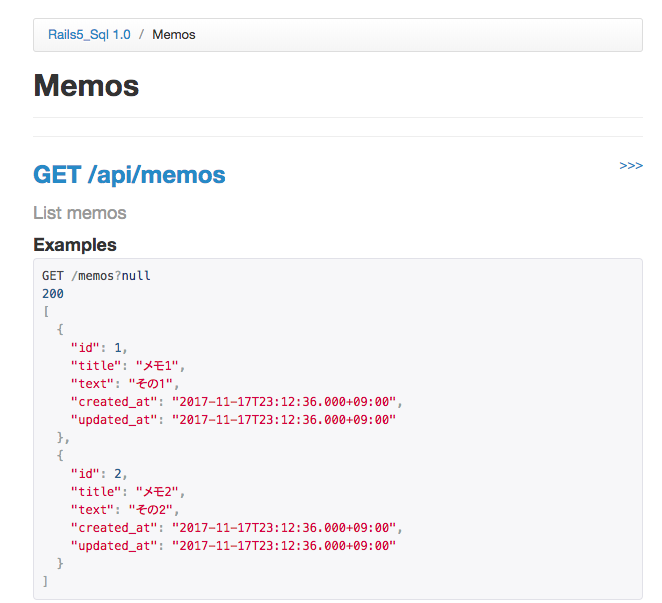
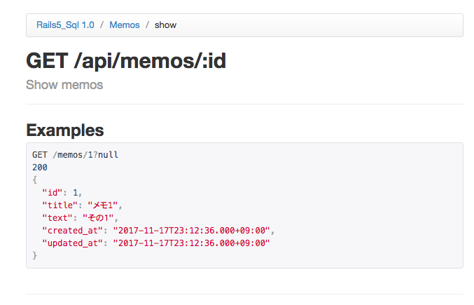
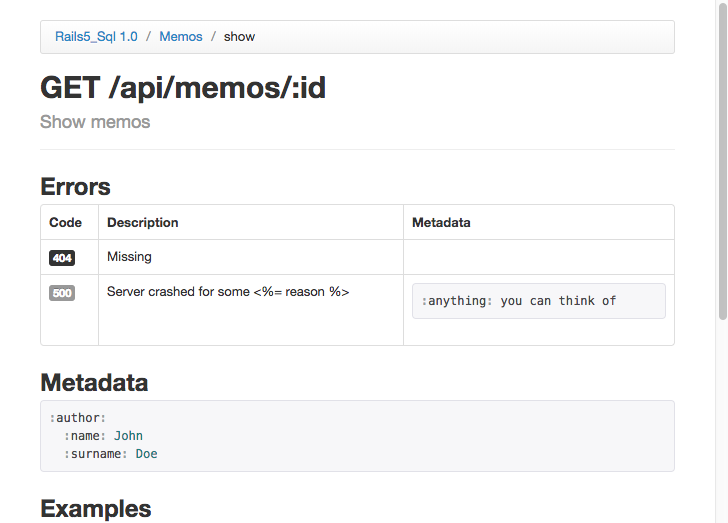
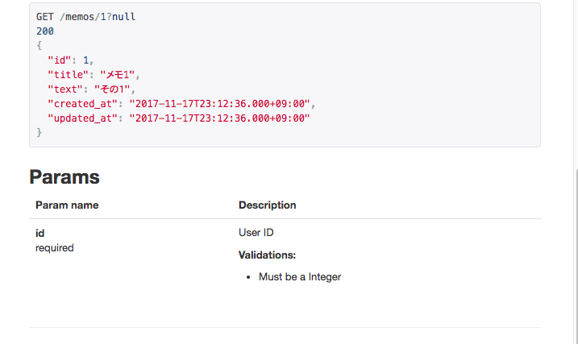

# README

See

- http://l-chika.hatenablog.com/entry/2017/10/10/134852  
  RailsのAPIモードでドキュメントを作成するならapipie-rails  

- https://www.youtube.com/watch?v=fkACBI0fcRI  
  Ruby on Rails Api Documentation (Apipie Gem)  

- https://qiita.com/mya106/items/bcbe77cc07cdf0576b5c
  Rails 5のAPIモードでToDoアプリ用のREST APIを作ってみる  

scaffold でモデルを作り、その Api ドキュメント生成していく。

```
$ bin/rails g scaffold Memo title:string text:text
$ bin/rails db:create db:migrate
```

別端末で、API を呼んでみる。

```
$ curl -H "Accept: application/json" -H "Content-type: application/json" -X POST "http://localhost:3000/memos"  -d '{"memo": {"title": "ABC"}}'

$ curl http://localhost:3000/memos
[{"id":1,"title":"ABC","text":null,"created_at":"2017-11-17T07:28:27.000+09:00","updated_at":"2017-11-17T07:28:27.000+09:00"}]
```

test/fixtures/memos.rb を作成してから、test が PASS するかを確認する。

test/fixtures/memos.rb
```
one:
  id: 1
  title: メモ1
  text: その１

two:
  id: 2
  title: メモ2
  text: その２
```

```
$ bundle exec rails test
```

# apipie 用の変更追加前の apipie の画面表示

```
$ bin/rake s
```

http://localhost:3000/apipie を web ブラウザで開く。



# apipie 用の記載を追加する。

app/controllers/memos_controller.rb
```
class MemosController < ApplicationController
  include Sub::TypesDoc
  ...
```

app/docs/memos_doc.rb
```
module MemosDoc
 # we need the DSL, right?
 extend Apipie::DSL::Concern

 api :GET, '/memos', 'List memos'
 def index
  # Nothing here, it's just a stub
 end

 api :GET, '/memo/:id', 'Show memos'
 def show
  # Nothing here, it's just a stub
 end

 api :POST, '/memo', 'Create memos'
 def create
  # Nothing here, it's just a stub
 end
end
```

# 追加後の画面表示





# テスト実行後の画面表示

```
$ APIPIE_RECORD=params bin/rake test
$ APIPIE_RECORD=examples bin/rake test
$ bin/rails s
```

test で実行されさ API 呼び出しのパラメータ、レスポンスがドキュメントに埋め込まれている！。






# パラメータやレスポンス内容の説明を追加する。

app/doc/memos_doc.rb
```
...
api :GET, '/memos/:id', 'Show memos'
param :id, Fixnum, :desc => "User ID", :required => true
error 404, "Missing"
error 500, "Server crashed for some <%= reason %>", :meta => {:anything => "you can think of"}
meta :author => {:name => 'John', :surname => 'Doe'}

def show
 # Nothing here, it's just a stub
end
...
```



